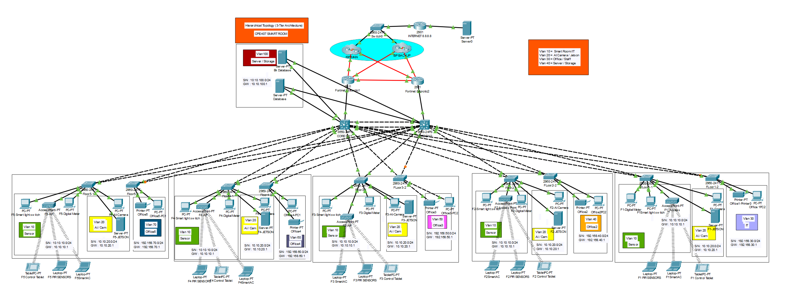

# 🏫 CPE407 Smart Room — Cisco Packet Tracer Network Design

> **Hierarchical Topology (3-Tier Architecture)** สำหรับอาคาร 5 ชั้น รองรับ IoT, AI Camera, Office และ Server ด้วยระบบ Redundancy เต็มรูปแบบ

---

## 📐 ภาพรวมระบบ (Network Overview)

ระบบเครือข่ายนี้ออกแบบตาม **3-Tier Hierarchical Architecture** ประกอบด้วย Core Layer, Firewall Layer และ Access Layer กระจายอยู่ใน 5 ชั้น โดยรองรับการทำงานแบบ High Availability ผ่าน HSRP, Dual Firewall และ Dual ISP

| Layer | อุปกรณ์ | จำนวน | หน้าที่ |
|---|---|---|---|
| Core L3 | Cisco 3650-24PS | 2 | HSRP, DHCP, Routing, EtherChannel |
| Firewall | Router 2901 | 2 | NAT, ISP Failover, Dual ISP |
| Access | Cisco 2960-24TT | 10 | VLAN Access, STP |
| ISP | Router 2911 | 2 | ISP1, ISP2 |
| Internet | Router 2901 | 1 | จำลอง Internet 8.8.8.8 |

---

## 🗺️ Topology Diagram



> Hierarchical 3-Tier Topology ประกอบด้วย Dual Core Switch → Dual Firewall → Dual ISP → Internet

---

## 🌐 VLAN & IP Address Plan

ระบบใช้ Network Segmentation แยกการใช้งานตามประเภทอุปกรณ์ เพื่อลด Broadcast Domain และเพิ่มความปลอดภัย Default Gateway ทุก VLAN อยู่ที่ Core Layer ผ่าน HSRP Virtual IP

| VLAN | Name | Subnet | Gateway (HSRP VIP) | DHCP SW1 | DHCP SW2 |
|---|---|---|---|---|---|
| 10 | Sensor / IoT | 10.10.10.0/24 | 10.10.10.1 | .10–.99 | .150–.249 |
| 20 | AI Camera / Jetson | 10.10.20.0/24 | 10.10.20.1 | .10–.99 | .150–.249 |
| 30 | IT / Management (SSH Only) | 192.168.30.0/24 | 192.168.30.1 | .10–.99 | .150–.249 |
| 40 | Office Floor 2 | 192.168.40.0/24 | 192.168.40.1 | .10–.99 | .150–.249 |
| 50 | Office Floor 3 | 192.168.50.0/24 | 192.168.50.1 | .10–.99 | .150–.249 |
| 60 | Office Floor 4 | 192.168.60.0/24 | 192.168.60.1 | .10–.99 | .150–.249 |
| 70 | Office Floor 5 | 192.168.70.0/24 | 192.168.70.1 | .10–.99 | .150–.249 |
| 100 | Server / Storage | 10.10.100.0/24 | 10.10.100.1 | .10–.99 | .150–.249 |
| 255 | Core Transit | 172.16.255.0/24 | 172.16.255.1 | — | — |

> **HSRP** คือโปรโตคอลที่สร้าง Default Gateway เสมือน ถ้า Core-SW1 ล่ม Core-SW2 จะรับหน้าที่ทันทีโดยอุปกรณ์ใน VLAN ยังใช้งานได้ต่อเนื่อง

### IP Address Summary

| Device | Interface | IP Address | หมายเหตุ |
|---|---|---|---|
| CORE-SW1 | Vlan255 | 10.255.255.6/29 | Transit to Firewall |
| CORE-SW2 | Vlan255 | 10.255.255.7/29 | Transit to Firewall |
| HSRP VIP | Vlan255 | 10.255.255.1/29 | Virtual Gateway (Active/Standby) |
| FIREWALL1 | Gi0/0 (Inside) | 10.255.255.2/29 | Core Transit (nat inside) |
| FIREWALL1 | Gi0/1/0 (HA) | 10.255.255.9/30 | HA Sync Link to FW2 |
| FIREWALL1 | Gi0/2/0 (ISP1) | 203.0.113.2/30 | WAN Primary (nat outside) |
| FIREWALL1 | Gi0/3/0 (ISP2) | 198.51.100.2/30 | WAN Backup (nat outside) |
| FIREWALL2 | Gi0/0 (Inside) | 10.255.255.3/29 | Core Transit (nat inside) |
| FIREWALL2 | Gi0/1/0 (HA) | 10.255.255.10/30 | HA Sync Link to FW1 |
| FIREWALL2 | Gi0/2/0 (ISP1) | 203.0.113.3/30 | WAN Primary |
| FIREWALL2 | Gi0/3/0 (ISP2) | 198.51.100.3/30 | WAN Backup |
| ISP1-Router | Gi0/3/0 → FW1 | 203.0.113.1/30 | FW1 Side |
| ISP1-Router | Gi0/2/0 → FW2 | 203.0.113.5/30 | FW2 Side |
| ISP2-Router | Gi0/3/0 → FW1 | 198.51.100.1/30 | FW1 Side |
| ISP2-Router | Gi0/2/0 → FW2 | 198.51.100.5/30 | FW2 Side |
| INTERNET-ROUTER | Gi0/0 / Lo0 | 8.8.8.8/24 | DNS Simulation Target |

---

## 🔌 Port Mapping — Physical Connections

### CORE-SW1 & CORE-SW2 (Cisco 3650-24PS)

| Port | Connection |
|---|---|
| Gi1/0/1 | SW Floor 1-2 |
| Gi1/0/2 | SW Floor 1-1 |
| Gi1/0/3 | SW Floor 2-2 |
| Gi1/0/4 | SW Floor 2-1 |
| Gi1/0/5 | SW Floor 3-2 |
| Gi1/0/6 | SW Floor 3-1 |
| Gi1/0/7 | SW Floor 4-2 |
| Gi1/0/8 | SW Floor 4-1 |
| Gi1/0/9 | SW Floor 5-2 |
| Gi1/0/10 | SW Floor 5-1 |
| Gi1/0/11 | Database Server |
| Gi1/0/12 | Backup Database |
| Gi1/0/13 | Firewall 1 |
| Gi1/0/14 | Firewall 2 |
| Gi1/0/15 | Link to CORE-SW2 / SW1 (EtherChannel) |

### Firewall Port Mapping

| Device | Interface | Network | Connection |
|---|---|---|---|
| FW1 | Gi0/0 | 10.255.255.2/29 | Inside → CORE-SW1 Gi1/0/13 (VLAN 255) |
| FW1 | Gi0/1/0 | 10.255.255.9/30 | HA Sync Link → FW2 |
| FW1 | Gi0/2/0 | 203.0.113.2/30 | WAN Primary → ISP1 |
| FW1 | Gi0/3/0 | 198.51.100.2/30 | WAN Backup → ISP2 |
| FW2 | Gi0/0 | 10.255.255.3/29 | Inside → CORE-SW2 Gi1/0/14 (VLAN 255) |
| FW2 | Gi0/1/0 | 10.255.255.10/30 | HA Sync Link → FW1 |
| FW2 | Gi0/2/0 | 203.0.113.3/30 | WAN Primary → ISP1 |
| FW2 | Gi0/3/0 | 198.51.100.3/30 | WAN Backup → ISP2 |

### Access Layer — Floor Port Assignment

ใช้ Access Switch รุ่น Cisco 2960-24TT สำหรับแต่ละชั้น เชื่อมต่อกับ Core Switch ทั้งสองตัวด้วย Trunk Link เพื่อรองรับ Redundancy

| Switch | Port | VLAN | Mode | Usage |
|---|---|---|---|---|
| SW-Floor1-1 | Fa0/1–2 | All | Trunk | Uplink to CORE-SW1 / SW2 |
| SW-Floor1-1 | Fa0/3–5 | 10 | Access | IoT Devices |
| SW-Floor1-1 | Fa0/6–7 | 20 | Access | AI Camera / Jetson |
| SW-Floor1-2 | Fa0/1–2 | All | Trunk | Uplink to CORE-SW1 / SW2 |
| SW-Floor1-2 | Fa0/3–4 | 30 | Access | Office Floor 1 (IT/Mgmt) |
| SW-Floor2-1 | Fa0/3–5 | 10 | Access | IoT Devices |
| SW-Floor2-1 | Fa0/6–7 | 20 | Access | AI Camera |
| SW-Floor2-2 | Fa0/3–4 | 40 | Access | Office Floor 2 |
| SW-Floor3-1 | Fa0/3–5 | 10 | Access | IoT Devices |
| SW-Floor3-1 | Fa0/6–7 | 20 | Access | AI Camera |
| SW-Floor3-2 | Fa0/3–4 | 50 | Access | Office Floor 3 |
| SW-Floor4-1 | Fa0/3–5 | 10 | Access | IoT Devices |
| SW-Floor4-1 | Fa0/6–7 | 20 | Access | AI Camera |
| SW-Floor4-2 | Fa0/3–4 | 60 | Access | Office Floor 4 |
| SW-Floor5-1 | Fa0/3–5 | 10 | Access | IoT Devices |
| SW-Floor5-1 | Fa0/6–7 | 20 | Access | AI Camera |
| SW-Floor5-2 | Fa0/3–4 | 70 | Access | Office Floor 5 |

---

## 🔄 HSRP Configuration

HSRP สร้าง Default Gateway เสมือน (Virtual IP) ให้มีตัวสำรองอัตโนมัติ โดยทำ Load Balance ข้าม VLAN ดังนี้

- **SW1 Active**: VLAN 10, 30, 50, 70, 100
- **SW2 Active**: VLAN 20, 40, 60

| VLAN | Active | Standby | Virtual IP | Priority Active | Priority Standby |
|---|---|---|---|---|---|
| 10 | CORE-SW1 | CORE-SW2 | 10.10.10.1 | 110 (preempt) | 100 |
| 20 | CORE-SW2 | CORE-SW1 | 10.10.20.1 | 110 (preempt) | 100 |
| 30 | CORE-SW1 | CORE-SW2 | 192.168.30.1 | 110 (preempt) | 100 |
| 40 | CORE-SW2 | CORE-SW1 | 192.168.40.1 | 110 (preempt) | 100 |
| 50 | CORE-SW1 | CORE-SW2 | 192.168.50.1 | 110 (preempt) | 100 |
| 60 | CORE-SW2 | CORE-SW1 | 192.168.60.1 | 110 (preempt) | 100 |
| 70 | CORE-SW1 | CORE-SW2 | 192.168.70.1 | 110 (preempt) | 100 |
| 100 | CORE-SW1 | CORE-SW2 | 10.10.100.1 | 110 (preempt) | 100 |
| 255 | CORE-SW1 | CORE-SW2 | 10.255.255.1 | 110 (preempt) | 100 |

---

## ⚙️ Full CLI Configuration

### 5.1 CORE-SW1 (Cisco 3650-24PS)

```
enable
configure terminal
hostname CORE-SW1
ip routing

! ─── VLAN Creation
vlan 10
 name IoT
vlan 20
 name AI
vlan 30
 name OFFICE1
vlan 40
 name OFFICE2
vlan 50
 name OFFICE3
vlan 60
 name OFFICE4
vlan 70
 name OFFICE5
vlan 100
 name SERVER
vlan 255
 name CORE-TRANSIT
exit

! ─── SVIs (Layer 3 per VLAN)
interface Vlan10
 ip address 10.10.10.2 255.255.255.0
 no shutdown
interface Vlan20
 ip address 10.10.20.2 255.255.255.0
 no shutdown
interface Vlan30
 ip address 192.168.30.2 255.255.255.0
 no shutdown
interface Vlan40
 ip address 192.168.40.2 255.255.255.0
 no shutdown
interface Vlan50
 ip address 192.168.50.2 255.255.255.0
 no shutdown
interface Vlan60
 ip address 192.168.60.2 255.255.255.0
 no shutdown
interface Vlan70
 ip address 192.168.70.2 255.255.255.0
 no shutdown
interface Vlan100
 ip address 10.10.100.2 255.255.255.0
 no shutdown
interface Vlan255
 ip address 10.255.255.6 255.255.255.248
 no shutdown

! ─── HSRP (SW1 = Active VLANs 10,30,50,70,100,255)
interface Vlan10
 standby version 2
 standby 10 ip 10.10.10.1
 standby 10 priority 110
 standby 10 preempt

interface Vlan20
 standby version 2
 standby 20 ip 10.10.20.1
 standby 20 priority 100
 standby 20 preempt

interface Vlan255
 standby version 2
 standby 255 ip 10.255.255.1
 standby 255 priority 110
 standby 255 preempt

! ─── EtherChannel to CORE-SW2 (LACP)
interface GigabitEthernet1/0/15
 description EtherChannel to CORE-SW2 (Po1)
 channel-group 1 mode active
 no shutdown

interface Port-channel1
 switchport mode trunk
 switchport trunk encapsulation dot1q
 switchport trunk allowed vlan all
 no shutdown

! ─── Default Routes
ip route 0.0.0.0 0.0.0.0 10.255.255.2 name PRIMARY_TO_FW1
ip route 0.0.0.0 0.0.0.0 10.255.255.3 10 name BACKUP_TO_FW2

! ─── DHCP Pools (SW1 = .10-.99 range)
ip dhcp excluded-address 10.10.10.1 10.10.10.9
ip dhcp excluded-address 10.10.10.100 10.10.10.254
ip dhcp pool VLAN10_IoT
 network 10.10.10.0 255.255.255.0
 default-router 10.10.10.1
 dns-server 8.8.8.8
 lease 1
! (ทำซ้ำสำหรับ VLAN 20,30,40,50,60,70,100)

! ─── DHCP Snooping
ip dhcp snooping
ip dhcp snooping vlan 10,20,30,40,50,60,70,100
no ip dhcp snooping information option

! ─── Spanning Tree
spanning-tree mode rapid-pvst
spanning-tree vlan 10,30,50,70,100 priority 4096  ! SW1 = Root
spanning-tree vlan 20,40,60 priority 8192          ! SW1 = Secondary

! ─── Security Hardening
service password-encryption
enable secret Cisco@1234
ip domain-name campus.local
crypto key generate rsa modulus 1024
ip ssh version 2
line vty 0 15
 transport input ssh
 exec-timeout 5 0
end
write memory
```

### 5.2 CORE-SW2 (Cisco 3650-24PS)

```
enable
configure terminal
hostname CORE-SW2
ip routing
! (VLAN creation เหมือนกัน)

interface Vlan10
 ip address 10.10.10.3 255.255.255.0
 no shutdown
interface Vlan255
 ip address 10.255.255.7 255.255.255.248
 no shutdown

! ─── HSRP (SW2 = Active VLANs 20,40,60)
interface Vlan20
 standby version 2
 standby 20 ip 10.10.20.1
 standby 20 priority 110
 standby 20 preempt

ip route 0.0.0.0 0.0.0.0 10.255.255.3 name PRIMARY_TO_FW2
ip route 0.0.0.0 0.0.0.0 10.255.255.2 10 name BACKUP_TO_FW1

spanning-tree vlan 20,40,60 priority 4096    ! SW2 = Root
spanning-tree vlan 10,30,50,70,100 priority 8192
end
write memory
```

### 5.3 FIREWALL1 (Cisco Router 2901)

```
enable
configure terminal
hostname FIREWALL1

interface GigabitEthernet0/0
 description Inside - Core Transit
 ip address 10.255.255.2 255.255.255.248
 ip nat inside
 no shutdown

interface GigabitEthernet0/1/0
 description HA Sync Link to FIREWALL2
 ip address 10.255.255.9 255.255.255.252
 no shutdown

interface GigabitEthernet0/2/0
 description WAN - ISP1 Primary
 ip address 203.0.113.2 255.255.255.252
 ip nat outside
 no shutdown

interface GigabitEthernet0/3/0
 description WAN - ISP2 Backup
 ip address 198.51.100.2 255.255.255.252
 ip nat outside
 no shutdown

! ─── NAT ACL & PAT
ip access-list standard NAT_INSIDE_NETWORKS
 permit 10.0.0.0 0.255.255.255
 permit 192.168.0.0 0.0.255.255

ip nat inside source list NAT_INSIDE_NETWORKS interface GigabitEthernet0/2/0 overload

! ─── Dual ISP Failover
ip route 0.0.0.0 0.0.0.0 203.0.113.1 name PRIMARY_ISP1
ip route 0.0.0.0 0.0.0.0 198.51.100.1 10 name BACKUP_ISP2

! ─── Return Routes to LAN
ip route 10.0.0.0 255.0.0.0 10.255.255.1
ip route 192.168.0.0 255.255.0.0 10.255.255.1

! ─── SSH & Security
ip ssh version 2
line vty 0 4
 transport input ssh
 exec-timeout 5 0
end
write memory
```

> **FIREWALL2** config คล้าย FW1 ยกเว้น: Inside IP = 10.255.255.3, HA Link = 10.255.255.10, ISP1 = 203.0.113.3, ISP2 = 198.51.100.3

### 5.4 ISP Routers & Internet Router

```
! ─── ISP1-ROUTER
hostname ISP1-ROUTER
interface GigabitEthernet0/1
 ip address 8.8.8.1 255.255.255.0
interface GigabitEthernet0/3/0
 ip address 203.0.113.1 255.255.255.252
interface GigabitEthernet0/2/0
 ip address 203.0.113.5 255.255.255.252

ip route 10.0.0.0 255.0.0.0 203.0.113.2
ip route 192.168.0.0 255.255.0.0 203.0.113.2
ip route 0.0.0.0 0.0.0.0 8.8.8.8

! ─── INTERNET-ROUTER (DNS Simulation 8.8.8.8)
hostname INTERNET-ROUTER
interface GigabitEthernet0/0
 ip address 8.8.8.8 255.255.255.0
interface Loopback0
 ip address 8.8.8.8 255.255.255.255

ip route 10.0.0.0 255.0.0.0 8.8.8.1
ip route 192.168.0.0 255.255.0.0 8.8.8.1
ip route 10.0.0.0 255.0.0.0 8.8.8.2 10
```

### 5.5 Access Switch — Floor Config (ตัวอย่าง SW-Floor1-1)

```
enable
configure terminal
hostname SW-Floor1-1

! ── Trunk Uplinks
interface FastEthernet0/1
 description Trunk to CORE-SW1
 switchport mode trunk
 switchport trunk allowed vlan all
 spanning-tree portfast trunk
 ip dhcp snooping trust

interface FastEthernet0/2
 description Trunk to CORE-SW2
 switchport mode trunk
 switchport trunk allowed vlan all
 spanning-tree portfast trunk
 ip dhcp snooping trust

! ── VLAN 10 IoT (Fa0/3-5)
interface range FastEthernet0/3 - 5
 switchport mode access
 switchport access vlan 10
 spanning-tree portfast
 spanning-tree bpduguard enable
 switchport port-security maximum 2
 switchport port-security violation restrict
 switchport port-security mac-address sticky
 switchport port-security

! ── VLAN 20 AI Camera (Fa0/6-7)
interface range FastEthernet0/6 - 7
 switchport mode access
 switchport access vlan 20
 spanning-tree portfast
 spanning-tree bpduguard enable
 switchport port-security maximum 2
 switchport port-security violation restrict
 switchport port-security mac-address sticky
 switchport port-security

ip dhcp snooping
ip dhcp snooping vlan 10,20,30,40,50,60,70,100
spanning-tree mode rapid-pvst
end
write memory
```

---

## 🔒 ACL — Inter-VLAN Security Policy

### Policy Matrix

| จาก VLAN | → V10 | → V20 | → V30 | → V40–70 | → V100 | Internet |
|---|---|---|---|---|---|---|
| V10 Sensor | ✅ | ❌ | ❌ | ❌ | ✅ | ✅ |
| V20 Camera | ❌ | ✅ | ❌ | ❌ | ✅ | ✅ |
| V30 IT (Full Access) | ✅ | ✅ | ✅ | ✅ | ✅ | ✅ |
| V40–70 Office | ❌ | ❌ | ❌ | ❌ | ✅ | ✅ |
| V100 Server | ✅ | ✅ | ✅ | ✅ | ✅ | ✅ |

### ACL Config — CORE-SW1 & CORE-SW2

```
! ─── VLAN10 Policy
ip access-list extended VLAN10_POLICY
 10 permit tcp 10.10.10.0 0.0.0.255 10.10.100.0 0.0.0.255 eq 80
 11 permit tcp 10.10.10.0 0.0.0.255 10.10.100.0 0.0.0.255 eq 443
 12 permit ip 10.10.10.0 0.0.0.255 10.10.10.0 0.0.0.255
 13 permit ip 10.10.10.0 0.0.0.255 10.10.100.0 0.0.0.255
 20 deny ip 10.10.10.0 0.0.0.255 10.0.0.0 0.255.255.255
 30 deny ip 10.10.10.0 0.0.0.255 192.168.0.0 0.0.255.255
 100 permit ip any any

! ─── Apply ACL to SVI
interface vlan 10
 ip access-group VLAN10_POLICY in
interface vlan 20
 ip access-group VLAN20_POLICY in
interface vlan 40
 ip access-group VLAN40_POLICY in
! (ทำซ้ำสำหรับ VLAN 50, 60, 70)
```

---

## 🔑 SSH Management — VLAN 30 Only

เฉพาะ VLAN 30 (192.168.30.0/24) เท่านั้นที่ SSH เข้าถึงอุปกรณ์ทุกตัวได้ โดยใช้ Access-Class 30 บน line vty

```
ip domain-name campus.local
crypto key generate rsa modulus 1024
ip ssh version 2
username itadmin privilege 15 secret Cisco@1234
enable secret Cisco@1234

! ─── Restrict SSH to VLAN30
access-list 30 permit 192.168.30.0 0.0.0.255

line vty 0 15
 login local
 transport input ssh
 access-class 30 in
```

**ทดสอบ SSH:**
```
ssh -l itadmin 10.255.255.6   ! เข้า CORE-SW1
ssh -l itadmin 10.255.255.2   ! เข้า FIREWALL1
```

---

## 📦 DHCP Redundancy

> ⚠️ แบ่ง DHCP Range ไม่ให้ Overlap: **SW1 = .10–.99** | **SW2 = .150–.249** เพื่อป้องกัน IP conflict เมื่อทั้งสอง Switch จ่าย DHCP พร้อมกัน

### CORE-SW1 DHCP (Range .10–.99)
```
ip dhcp excluded-address 10.10.10.1 10.10.10.9
ip dhcp excluded-address 10.10.10.100 10.10.10.254
ip dhcp pool VLAN10_IoT
 network 10.10.10.0 255.255.255.0
 default-router 10.10.10.1
 dns-server 8.8.8.8
 lease 1
```

### CORE-SW2 DHCP (Range .150–.249)
```
ip dhcp excluded-address 10.10.10.1 10.10.10.149
ip dhcp excluded-address 10.10.10.250 10.10.10.254
ip dhcp pool VLAN10_IoT
 network 10.10.10.0 255.255.255.0
 default-router 10.10.10.1
 dns-server 8.8.8.8
 lease 1
```

---

## 🏠 IoT Configuration

### Registration Server Setup
1. คลิก Server VLAN100 → Services → IoT → On
2. User: `admin` / Password: `admin`

### Smart Light / IoT Device Setup
1. วาง IoT Device (Smart Light) จาก End Devices → Home
2. Config → Wireless0 → ใส่ SSID ให้ตรงกับ AP ของ Floor นั้น
3. เลือก Remote Server: `10.10.100.21` / User: `admin` / Password: `admin`

### Control via Web Browser
```
PC VLAN30 → Desktop → Web Browser → http://10.10.100.21/home.html
Login: admin / admin → คลิก On/Off
```

---

## 🧪 Redundancy Test Procedures

> ⚠️ **PT Limitation:** floating static route ไม่ detect next-hop down อัตโนมัติ ต้องทำ manual (no ip route + shutdown port พร้อมกัน)

### 10.1 ISP Failover Test (FW1: ISP1 → ISP2)
```
configure terminal
no ip route 0.0.0.0 0.0.0.0 203.0.113.1
interface GigabitEthernet0/2/0
 shutdown
do show ip route   ! ต้องเห็น via 198.51.100.1
```

### 10.2 Firewall Failover Test (FW2 → FW1)
```
configure terminal
no ip route 0.0.0.0 0.0.0.0 10.255.255.3
interface GigabitEthernet1/0/14
 shutdown
show ip route   ! ต้องเห็น via 10.255.255.2
```

### 10.3 DHCP Failover Test (SW1 → SW2)
```
configure terminal
interface vlan 10
 shutdown
! (ทำซ้ำ vlan 20-100, 255)
no ip route 0.0.0.0 0.0.0.0 10.255.255.2
! ตรวจสอบบน CORE-SW2
show standby brief        ! ต้องเห็น Active ทุก VLAN
show ip dhcp binding      ! IP ใหม่ต้องอยู่ใน range .150-.249
```

### ผลการทดสอบ Redundancy

| Test | Scenario | สิ่งที่ตรวจสอบ | ผล |
|---|---|---|---|
| 1A | FW1: ISP1 → ISP2 | show ip route → via 198.51.100.1 | ✅ ผ่าน |
| 1B | FW2: ISP1 → ISP2 | show ip route → via 198.51.100.5 | ✅ ผ่าน |
| 2A | FW2 ล่ม → FW1 | SW2 route → via 10.255.255.2 | ✅ ผ่าน |
| 2B | FW1 ล่ม → FW2 | SW1 route → via 10.255.255.3 | ✅ ผ่าน |
| 3A | SW1 ล่ม → SW2 DHCP | DHCP binding .150–.249 range | ✅ ผ่าน |
| 3B | SW2 ล่ม → SW1 DHCP | DHCP binding .10–.99 range | ✅ ผ่าน |
| 4 | HSRP Failover | standby brief → Active สลับ | ✅ ผ่าน |

---

## ⚠️ Packet Tracer Limitations & Workarounds

| Feature | ข้อจำกัด | Workaround |
|---|---|---|
| IP SLA | ไม่รองรับบน 3650 | ใช้ manual no ip route แทน |
| Floating Static | ไม่ detect next-hop down ใน connected subnet | no ip route + shutdown port พร้อมกัน |
| interface range vlan | ไม่รองรับ | ทำทีละ interface vlan |
| clear ip dhcp binding * | ไม่รองรับ | clear ทีละ IP หรือ no service dhcp + service dhcp |
| NAT multiple ACL | 1 statement ต่อ ACL | ใช้ ACL แยก NAT_ISP1 / NAT_ISP2 |
| LACP EtherChannel | negotiate ไม่ได้บางกรณี | ใช้ channel-group mode on แทน mode active |
| DHCP Conflict | SW2 conflict กับ SW1 เมื่อ range overlap | แบ่ง range ชัดเจน SW1=.10–.99 / SW2=.150–.249 |
| HSRP v2 | ต้องเปิด standby version 2 ทั้งสอง Core | ใส่ standby version 2 ทุก SVI ก่อน standby command |

---

## 🔍 Quick Verify Commands

### Core Switch
```
show vlan brief                          ! รายการ VLAN ทั้งหมด
show ip route                            ! ตาราง Routing
show standby brief                       ! สถานะ HSRP (Active/Standby/VIP)
show etherchannel summary                ! สถานะ EtherChannel
show ip dhcp binding                     ! IP ที่ DHCP แจก
show ip dhcp pool                        ! รายละเอียด DHCP Pool
show ip dhcp conflict                    ! IP ที่เกิด conflict
show spanning-tree                       ! สถานะ Spanning Tree ทุก VLAN
show ip access-lists                     ! รายการ ACL
show interfaces trunk                    ! พอร์ตที่เป็น trunk
show port-security                       ! สถานะ Port Security
show ip dhcp snooping binding            ! ตาราง DHCP Snooping
```

### Firewall
```
show ip route                            ! ตาราง Routing
show ip nat translations                 ! รายการ NAT
show ip nat statistics                   ! สถิติ NAT
show run | include nat                   ! NAT config
show ip interface brief                  ! สถานะ interface
```

### PC / End Device
```
ipconfig                                 ! แสดง IP, Subnet, Gateway
ipconfig /release                        ! ปล่อย IP จาก DHCP
ipconfig /renew                          ! ขอ IP ใหม่จาก DHCP
ping 10.10.10.1                          ! ทดสอบ IoT gateway
ping 192.168.30.1                        ! ทดสอบ Office gateway
ping 8.8.8.8                             ! ทดสอบ Internet
traceroute 8.8.8.8                       ! ดูเส้นทาง packet
```

---

## 📁 Project Structure

```
.
├── README.md
├── topology.png                         # Network Topology Diagram
└── CPE407_SmartRoom.pkt                 # Cisco Packet Tracer File
```

---

## 👨‍💻 Technologies Used

- Cisco Packet Tracer (Simulation)
- Cisco 3650-24PS (Layer 3 Core Switch)
- Cisco 2960-24TT (Access Switch)
- Cisco Router 2901 / 2911
- HSRP v2, EtherChannel (LACP), Rapid PVST+
- NAT/PAT, Dual ISP Failover
- DHCP Snooping, Port Security
- SSH v2, ACL Inter-VLAN Policy
